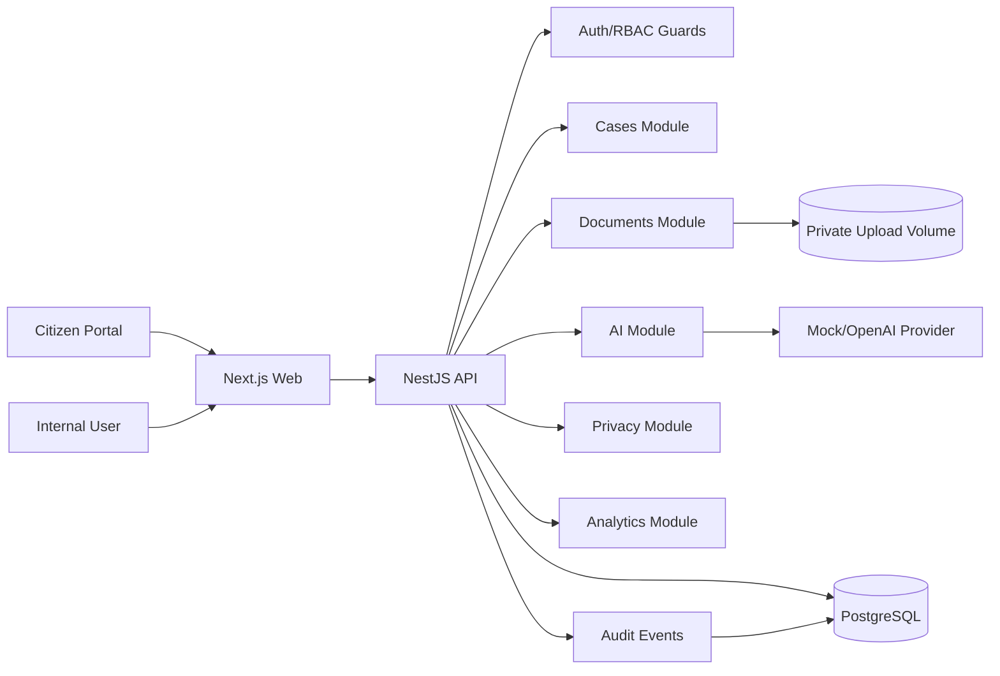
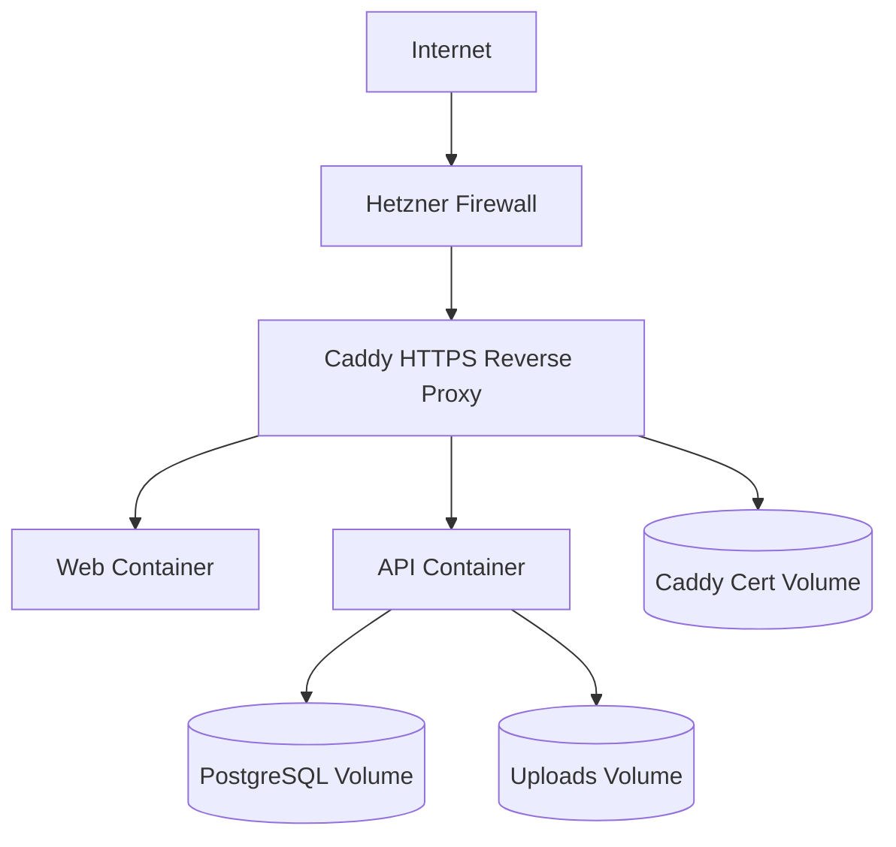

# KommuneFlow AI

KommuneFlow AI is a portfolio-grade municipal case workflow platform. It demonstrates multi-tenant case intake, document handling, AI-assisted triage, human review, RBAC, audit logging, privacy workflows, retention, analytics, and production-like deployment discipline.

The project is inspired by Norwegian municipal service delivery. It is a demo system and must not be used with real citizen data without a real controller/processor setup, legal basis, DPIA, production hardening review, and deployed privacy operations.

## Product

Citizens can submit a request to a municipality, attach documents, and receive a case ID. Municipal employees use the internal dashboard to review cases, upload/download documents, run AI triage, approve or correct AI suggestions, update status, and view operational analytics.

AI is decision support only. Official case category, department, urgency, and status change only after human review.

## Feature Highlights

- Multi-tenant PostgreSQL data model
- Public citizen intake in Norwegian Bokmal and English
- Citizen document upload during intake
- Internal case dashboard and case detail view
- Secure document upload and download
- AI provider abstraction with mock and OpenAI providers
- Human-in-the-loop AI triage review
- Role-based access control and tenant isolation
- `HttpOnly` cookie authentication for internal UI
- Audit events for case, document, AI, privacy, and retention actions
- Citizen data export and anonymization
- Retention policy and dry-run/confirmed cleanup
- Aggregated analytics dashboard
- Health/readiness endpoints and structured logging
- Production Dockerfiles, Caddy reverse proxy, backup/restore scripts, and Hetzner deployment docs

## Tech Stack

- TypeScript
- NestJS API
- Next.js web app
- PostgreSQL
- Prisma
- Zod validation
- pnpm monorepo
- Docker Compose
- Caddy for production reverse proxy and HTTPS
- Jest and Supertest

## Architecture



Production target:



## Security And Privacy

Implemented controls include:

- Password hashing with bcrypt
- `HttpOnly` auth cookie
- JWT expiry and production secret enforcement
- Rate limiting
- Helmet security headers
- Strict CORS allowlist
- Origin/Referer validation for cookie-authenticated mutations
- Explicit JSON/form body limits
- Server-side permission guards
- Tenant-scoped database queries
- Negative auth/RBAC/tenant tests
- File size, extension, MIME, magic-byte, and filename validation
- Private upload storage
- Secure document download with audit events
- Safe error response shape with request IDs
- Privacy export, anonymization, retention policy, and retention cleanup
- Aggregated analytics without citizen identifiers

Privacy docs:

- [Privacy Notice](./docs/privacy/PRIVACY_NOTICE.md)
- [Data Processing Inventory](./docs/privacy/DATA_PROCESSING_INVENTORY.md)
- [DPIA-Lite](./docs/privacy/DPIA_LITE.md)

## AI Governance

AI suggestions are stored separately from official case fields. The system validates AI output with Zod and records human review decisions. AI provider calls are abstracted behind `AIProvider`, so local tests and demos can use `MockAIProvider` without calling the OpenAI API.

Current limitation: OpenAI retry/timeout policy, redaction/minimization, and cost/latency metrics should be expanded before real production use.

## Demo Users

Seeded demo users use this password:

```txt
DemoPassword123!
```

| Role | Email | Notes |
| --- | --- | --- |
| Super admin | `super.admin@kommuneflow.local` | Tenant-wide admin and privacy actions |
| Case worker | `case.worker@arendal.local` | Department-scoped case handling |
| Department admin | `department.admin@arendal.local` | Department admin and analytics access |
| Auditor | `auditor@arendal.local` | Read-only audit/privacy visibility |
| Grimstad case worker | `case.worker@grimstad.local` | Cross-tenant isolation demo |

Demo credentials are for local/demo use only and must never be reused in production.

## Local Setup

Requirements:

- Node.js 24+
- pnpm 10+
- Docker Desktop

Install dependencies:

```bash
pnpm install
```

Copy environment variables:

```bash
cp .env.example .env
```

Start PostgreSQL:

```bash
docker compose up -d postgres
```

Generate Prisma client:

```bash
pnpm --filter @kommuneflow/api prisma:generate
```

Run migrations and seed demo data:

```bash
pnpm --filter @kommuneflow/api prisma:migrate
pnpm --filter @kommuneflow/api prisma:seed
```

Start API and web:

```bash
pnpm dev
```

Local URLs:

- Web: `http://localhost:3000`
- API: `http://localhost:3101/api/v1`
- Citizen intake Norwegian: `http://localhost:3000/nb`
- Citizen intake English: `http://localhost:3000/en`
- Internal login: `http://localhost:3000/internal/login`
- Internal cases: `http://localhost:3000/internal/cases`
- Internal analytics: `http://localhost:3000/internal/analytics`

## Useful Commands

```bash
pnpm lint
pnpm typecheck
pnpm test
pnpm build
pnpm audit:deps
pnpm --filter @kommuneflow/api test:e2e
pnpm --filter @kommuneflow/api prisma:migrate
pnpm --filter @kommuneflow/api prisma:seed
```

## API Overview

See [API Reference](./docs/API_REFERENCE.md).

Main API groups:

- `auth`
- `public/tenants/:tenantSlug/cases`
- `cases`
- `documents`
- `ai-triage`
- `analytics`
- `privacy`
- `health` and `readiness`

## Production Deployment

The repository includes production-like deployment assets:

- `apps/api/Dockerfile`
- `apps/web/Dockerfile`
- `docker-compose.prod.yml`
- `deploy/Caddyfile`
- `.env.production.example`
- `scripts/backup-postgres.sh`
- `scripts/backup-uploads.sh`
- `scripts/restore-postgres.sh`
- `scripts/smoke-test.sh`

Basic production flow:

```bash
cp .env.production.example .env.production
docker compose -f docker-compose.prod.yml --env-file .env.production build
docker compose -f docker-compose.prod.yml --env-file .env.production up -d postgres
docker compose -f docker-compose.prod.yml --env-file .env.production run --rm --entrypoint sh api -lc "./node_modules/.bin/prisma migrate deploy"
docker compose -f docker-compose.prod.yml --env-file .env.production up -d
sh scripts/smoke-test.sh https://your-domain.example
```

See [Hetzner Deployment](./docs/07_DEPLOYMENT_HETZNER.md) for firewall, HTTPS, backup, restore, and smoke-test details.

Deployment status: production assets are implemented and locally verified. Public Hetzner HTTPS deployment still needs to be executed and verified on a real host.

## Testing Status

Current verified commands:

```txt
pnpm lint       PASS
pnpm typecheck  PASS
pnpm test       PASS
pnpm build      PASS
```

The API test suite includes unit, service, controller, auth, RBAC, tenant isolation, file upload abuse, AI safety, analytics, privacy, and retention tests.

## Demo Flow

1. Open `http://localhost:3000/en`.
2. Submit a citizen case with an optional PDF/PNG/JPG document.
3. Log in at `http://localhost:3000/internal/login`.
4. Open the case dashboard.
5. Open the new case detail page.
6. Review/download documents.
7. Run AI triage.
8. Accept or correct the AI suggestion.
9. Update case status and add an internal note.
10. Open analytics and run aggregation for the current date range.

See [Demo Script](./docs/DEMO_SCRIPT.md) for an interview-ready walkthrough.

## Known Limitations

- Public Hetzner HTTPS deployment has not been verified on a real host yet.
- Citizen status lookup after submission is not implemented.
- Email confirmation is not implemented.
- Document OCR/PDF text extraction is not implemented.
- Malware scanning is represented as a future provider concern, not a real scanner.
- AI calls are synchronous in the request path.
- AI prompt redaction/minimization should be expanded before real production use.
- Internal UI is still mostly English, while citizen intake is bilingual.
- Privacy actions exist in API, but there is no full internal privacy UI.
- Demo seed data is still smaller than the final portfolio target.

## Future Improvements

- Real Hetzner deployment and screenshots
- Larger realistic demo dataset
- Citizen status portal
- Email confirmations
- Background worker for AI and analytics aggregation
- PDF text extraction and document summarization
- Malware scanning provider
- Full internal i18n
- API OpenAPI/Swagger generation
- Object storage adapter
- Advanced audit search UI
- Deployment monitoring and metrics dashboard

## Portfolio Description

English:

KommuneFlow AI is a portfolio project inspired by Norwegian municipal digital services. It is a multi-tenant platform for citizen case intake, document workflows, AI-assisted triage, role-based access control, audit logging, privacy operations, retention, and aggregated analytics. AI is used as human-reviewed decision support, not as an automatic decision-maker.

Norwegian:

KommuneFlow AI er et portefoljeprosjekt inspirert av norsk kommunal tjenesteutvikling. Losningen er en multi-tenant plattform for innbyggerhenvendelser, dokumentflyt, KI-assistert saksruting, rollebasert tilgangsstyring, audit-logg, personvernarbeid, retensjon og aggregert analyse. KI brukes som beslutningsstotte med menneskelig kvalitetssikring, ikke som automatisk beslutningstaker.

## Workspace Structure

```txt
apps/
  api/
  web/
packages/
  shared/
docs/
```

## Development Rules

- Code, API routes, database names, comments, and documentation are written in English.
- User-facing UI supports Norwegian Bokmal (`nb`) and English (`en`) where implemented.
- Authorization and tenant isolation are enforced server-side.
- AI output is treated as untrusted data and validated before storage.
