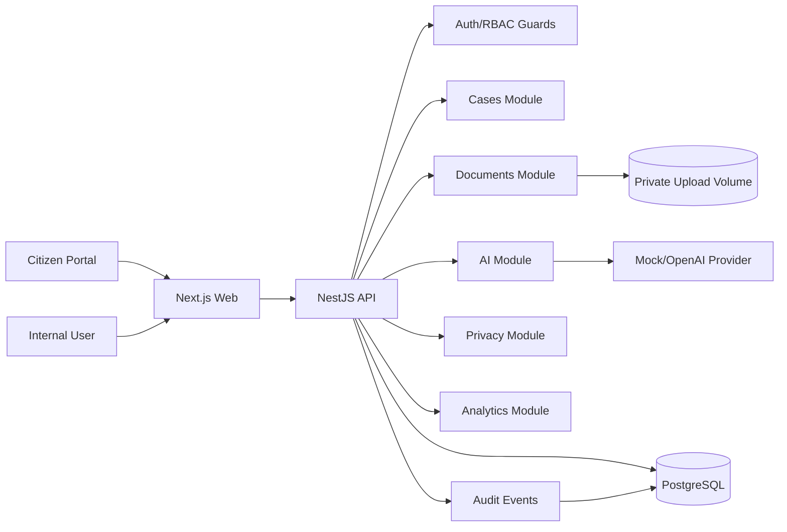
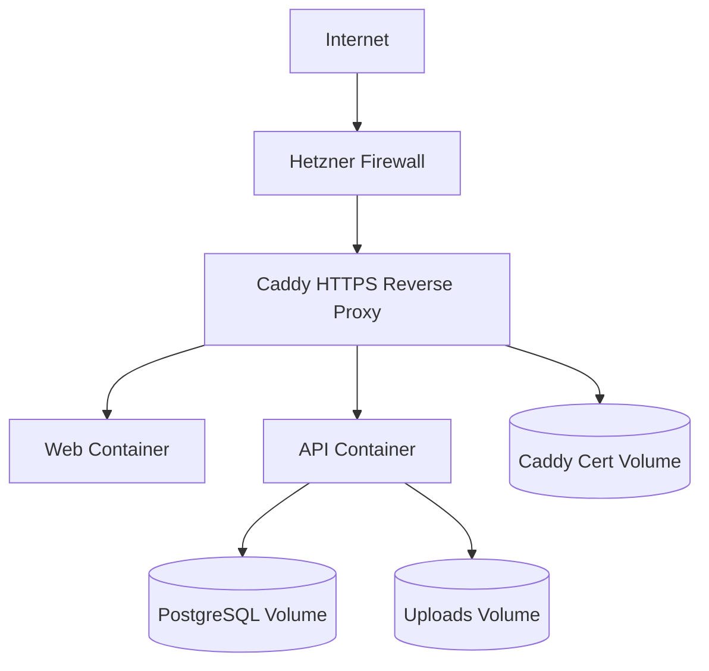

# KommuneFlow AI

KommuneFlow AI is a portfolio-grade municipal case workflow platform. It demonstrates multi-tenant case intake, document handling, AI-assisted triage, human review, RBAC, audit logging, privacy workflows, retention, analytics, and production-like deployment discipline.

The project is inspired by Norwegian municipal service delivery. It is a demo system and must not be used with real citizen data without a real controller/processor setup, legal basis, DPIA, production hardening review, and deployed privacy operations.

## Product

Citizens can submit a request to a municipality, attach documents, and receive a case ID. Municipal employees use the internal dashboard to review cases, upload/download documents, run AI triage, approve or correct AI suggestions, update status, and view operational analytics.

AI is decision support only. Official case category, department, urgency, and status change only after human review.

## Feature Highlights

- Multi-tenant PostgreSQL data model
- Public citizen intake in Norwegian Bokmal and English
- Citizen document upload during intake
- Internal employee UI in Norwegian Bokmal and English
- Internal case dashboard and case detail view
- Secure document upload and download
- Kartverket address search and validation during citizen intake
- AI provider abstraction with mock and OpenAI providers
- Human-in-the-loop AI triage review
- Role-based access control and tenant isolation
- `HttpOnly` cookie authentication for internal UI
- Audit events for case, document, AI, privacy, and retention actions
- Persisted operational events for metrics and incident-style visibility
- Citizen data export and anonymization
- Retention policy and dry-run/confirmed cleanup
- Aggregated analytics dashboard with SSB population enrichment
- Python ELT package for analytics rebuilds and SSB import
- Health/readiness endpoints and structured logging
- Production Dockerfiles, Caddy reverse proxy, backup/restore scripts, and Hetzner deployment docs

## Tech Stack

- TypeScript
- NestJS API
- Next.js web app
- PostgreSQL
- Prisma
- Zod validation
- pnpm monorepo
- Docker Compose
- Caddy for production reverse proxy and HTTPS
- Jest and Supertest

## Architecture



Production target:



## Security And Privacy

Implemented controls include:

- Password hashing with bcrypt
- `HttpOnly` auth cookie
- JWT expiry and production secret enforcement
- Rate limiting
- Helmet security headers
- Strict CORS allowlist
- Origin/Referer validation for cookie-authenticated mutations
- Explicit JSON/form body limits
- Public and internal rate-limit blocks persisted as operational events
- Server-side permission guards
- Tenant-scoped database queries
- Negative auth/RBAC/tenant tests
- File size, extension, MIME, magic-byte, and filename validation
- Private upload storage
- Secure document download with audit events
- Safe error response shape with request IDs
- Privacy export, anonymization, retention policy, and retention cleanup
- Aggregated analytics without citizen identifiers

Privacy docs:

- [Privacy Notice](./docs/privacy/PRIVACY_NOTICE.md)
- [Data Processing Inventory](./docs/privacy/DATA_PROCESSING_INVENTORY.md)
- [DPIA-Lite](./docs/privacy/DPIA_LITE.md)

## AI Governance

AI suggestions are stored separately from official case fields. The system validates AI output with Zod and records human review decisions. AI provider calls are abstracted behind `AIProvider`, so local tests and demos can use `MockAIProvider` without calling the OpenAI API.

Current limitation: AI calls are still synchronous in the request path. Before real production use, AI processing should move to a background worker, with stronger PII redaction, cost monitoring, and retry/backoff policies.

## Demo Users

Seeded demo users use this password:

```txt
DemoPassword123!
```

| Role | Email | Notes |
| --- | --- | --- |
| Super admin | `super.admin@kommuneflow.local` | Tenant-wide admin and privacy actions |
| Case worker | `case.worker@arendal.local` | Department-scoped case handling |
| Department admin | `department.admin@arendal.local` | Department admin and analytics access |
| Auditor | `auditor@arendal.local` | Read-only audit/privacy visibility |
| Grimstad case worker | `case.worker@grimstad.local` | Cross-tenant isolation demo |

Demo credentials are for local/demo use only and must never be reused in production.

## Demo Data

The seed creates a realistic local portfolio dataset:

- tenants: Arendal Kommune, Grimstad Kommune, Kristiansand Kommune
- five departments per tenant
- 20 realistic cases across statuses, categories, and urgencies
- Norwegian and English case descriptions
- validated address rows with municipality codes
- demo documents
- accepted, corrected, failed, and low-confidence AI triage examples
- SSB municipality population records
- analytics snapshots
- audit and operational events

The seed is idempotent and split into small modules under `apps/api/prisma/seed`.

## Local Setup

Requirements:

- Node.js 24+
- pnpm 10+
- Docker Desktop

Install dependencies:

```bash
pnpm install
```

Copy environment variables:

```bash
cp .env.example .env
```

Start PostgreSQL:

```bash
docker compose up -d postgres
```

Generate Prisma client:

```bash
pnpm --filter @kommuneflow/api prisma:generate
```

Run migrations and seed demo data:

```bash
pnpm --filter @kommuneflow/api prisma:migrate
pnpm --filter @kommuneflow/api prisma:seed
```

Start API and web:

```bash
pnpm dev
```

Local URLs:

- Web: `http://localhost:3000`
- API: `http://localhost:3101/api/v1`
- Citizen intake Norwegian: `http://localhost:3000/nb`
- Citizen intake English: `http://localhost:3000/en`
- Internal login: `http://localhost:3000/internal/login`
- Internal cases: `http://localhost:3000/internal/cases`
- Internal analytics: `http://localhost:3000/internal/analytics`
- Internal operations: `http://localhost:3000/internal/operations`
- Internal privacy: `http://localhost:3000/internal/privacy`

## Useful Commands

```bash
pnpm lint
pnpm typecheck
pnpm test
pnpm build
pnpm audit:deps
pnpm --filter @kommuneflow/api test:e2e
pnpm --filter @kommuneflow/api prisma:migrate
pnpm --filter @kommuneflow/api prisma:seed
cd apps/etl && python -m pytest -q
```

Manual SSB verification command:

```bash
cd apps/etl
python -m kommuneflow_elt.cli import-ssb --year 2025 --municipality-code 4203
```

Do not run real Kartverket, SSB, or OpenAI calls in CI.

## API Overview

See [API Reference](./docs/API_REFERENCE.md).

Main API groups:

- `auth`
- `public/tenants/:tenantSlug/cases`
- `cases`
- `documents`
- `ai-triage`
- `analytics`
- `integrations/kartverket`
- `integrations/ssb`
- `operations`
- `privacy`
- `health` and `readiness`

## Production Deployment

The repository includes production-like deployment assets:

- `apps/api/Dockerfile`
- `apps/web/Dockerfile`
- `docker-compose.prod.yml`
- `deploy/Caddyfile`
- `.env.production.example`
- `scripts/backup-postgres.sh`
- `scripts/backup-uploads.sh`
- `scripts/restore-postgres.sh`
- `scripts/smoke-test.sh`

Basic production flow:

```bash
cp .env.production.example .env.production
docker compose -f docker-compose.prod.yml --env-file .env.production build
docker compose -f docker-compose.prod.yml --env-file .env.production up -d postgres
docker compose -f docker-compose.prod.yml --env-file .env.production run --rm --entrypoint sh api -lc "./node_modules/.bin/prisma migrate deploy"
docker compose -f docker-compose.prod.yml --env-file .env.production up -d
sh scripts/smoke-test.sh https://your-domain.example
```

See [Hetzner Deployment](./docs/07_DEPLOYMENT_HETZNER.md) for firewall, HTTPS, backup, restore, and smoke-test details.

Deployment status: production assets are implemented and locally verified. Public Hetzner HTTPS deployment still needs to be executed and verified on a real host.

## Testing Status

Current verified commands:

```txt
pnpm lint       PASS
pnpm typecheck  PASS
pnpm test       PASS
pnpm build      PASS
python -m pytest -q in apps/etl PASS
```

The API test suite includes unit, service, controller, auth, RBAC, tenant isolation, file upload abuse, AI safety, analytics, privacy, operations, and retention tests. API e2e covers health/security checks and a full business flow from citizen intake to AI review, status update, analytics, operations metrics, and audit evidence.

## Demo Flow

1. Open `http://localhost:3000/nb` or `http://localhost:3000/en`.
2. Submit a citizen case with an address and optional PDF/PNG/JPG document.
3. Log in at `http://localhost:3000/internal/login`.
4. Switch the internal UI between Norwegian Bokmal and English.
5. Open the case dashboard and inspect seeded cases.
6. Open a case detail page.
7. Review Kartverket address enrichment and download documents.
8. Run AI triage.
9. Accept or correct the AI suggestion.
10. Update case status and add an internal note.
11. Open analytics and run aggregation for the current date range.
12. Open operations and review health, readiness, integration, AI, document, rate-limit, and operational event metrics.
13. Open privacy and run a citizen data export or retention dry run.

See [Demo Script](./docs/DEMO_SCRIPT.md) for an interview-ready walkthrough.

## Known Limitations

- Public Hetzner HTTPS deployment has not been verified on a real host yet.
- Citizen status lookup is implemented with case reference and access code, but a richer citizen portal is still future work.
- Email confirmation is logged through a mock provider; real SMTP/transactional email is future production work.
- Document OCR/PDF text extraction is not implemented.
- Malware scanning is represented as a future provider concern, not a real scanner.
- AI calls are synchronous in the request path.
- AI prompt redaction/minimization should be expanded before real production use.
- Privacy actions have a simple internal UI; a fuller workflow with approvals and scheduled retention jobs is future work.

## Future Improvements

- Real Hetzner deployment and screenshots
- Additional demo scenarios after screenshots and final README polish
- Background worker for AI triage, analytics rebuild, SSB import, and notification delivery
- Real email provider integration
- PDF text extraction and document summarization
- Malware scanning provider
- Route-level internal locale URLs if the demo needs shareable localized internal links
- API OpenAPI/Swagger generation
- Object storage adapter
- Advanced audit search UI
- Deployment monitoring and metrics dashboard

## Portfolio Description

KommuneFlow AI is a portfolio project inspired by Norwegian municipal digital services. It is a multi-tenant platform for citizen case intake, Kartverket address validation, document workflows, human-reviewed AI triage, role-based access control, audit logging, privacy operations, retention, SSB-enriched analytics, and operations monitoring. AI is used as decision support, not as an automatic decision-maker.

## Workspace Structure

```txt
apps/
  api/
  etl/
  web/
docs/
```

## Development Rules

- Code, API routes, database names, comments, and documentation are written in English.
- User-facing UI supports Norwegian Bokmal (`nb`) and English (`en`) where implemented.
- Authorization and tenant isolation are enforced server-side.
- AI output is treated as untrusted data and validated before storage.
