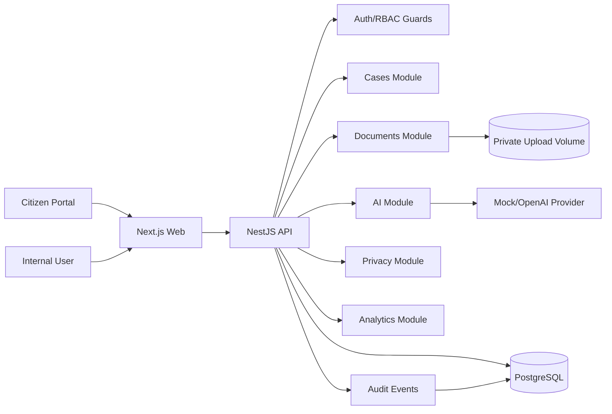
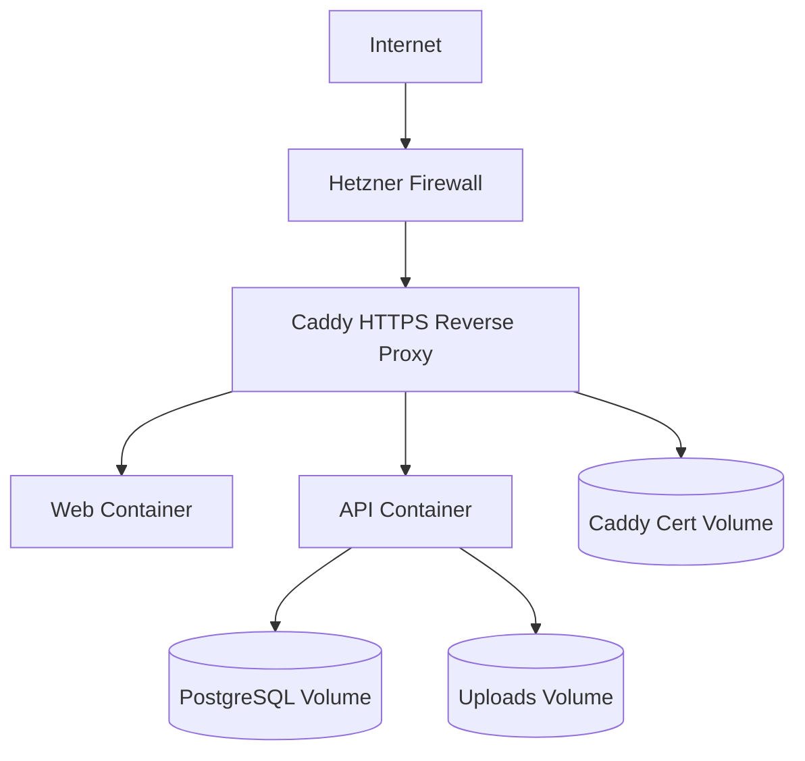

# KommuneFlow AI

KommuneFlow AI is a portfolio-grade municipal case workflow platform. It demonstrates multi-tenant case intake, document handling, AI-assisted triage, human review, RBAC, audit logging, privacy workflows, retention, analytics, and production-like deployment discipline.

The project is inspired by Norwegian municipal service delivery. It is a demo system and must not be used with real citizen data without a real controller/processor setup, legal basis, DPIA, production hardening review, and deployed privacy operations.

## Product

Citizens can submit a request to a municipality, attach documents, and receive a case ID. Municipal employees use the internal dashboard to review cases, upload/download documents, run AI triage, approve or correct AI suggestions, update status, and view operational analytics.

AI is decision support only. Official case category, department, urgency, and status change only after human review.

## Feature Highlights

- Multi-tenant PostgreSQL data model
- Public citizen intake in Norwegian Bokmal and English
- Citizen document upload during intake
- Internal employee UI in Norwegian Bokmal and English
- Internal case dashboard and case detail view
- Secure document upload and download
- Kartverket address search and validation during citizen intake
- AI provider abstraction with mock and OpenAI providers
- Human-in-the-loop AI triage review
- Role-based access control and tenant isolation
- `HttpOnly` cookie authentication for internal UI
- Audit events for case, document, AI, privacy, and retention actions
- Persisted operational events for metrics and incident-style visibility
- Citizen data export and profile identifier anonymization
- Retention policy and dry-run/confirmed cleanup
- Aggregated analytics dashboard with SSB population enrichment
- Python ELT package for analytics rebuilds and SSB import
- Health/readiness endpoints and structured logging
- Production Dockerfiles, Caddy reverse proxy, backup/restore scripts, and Hetzner deployment docs
- Microsoft Azure, AI Foundry, and Fabric extension plan

## Tech Stack

- TypeScript
- NestJS API
- Next.js web app
- PostgreSQL
- Prisma
- Zod validation
- pnpm monorepo
- Docker Compose
- Caddy for production reverse proxy and HTTPS
- Jest, Supertest, Vitest, Playwright, and pytest

## Architecture



Production target:



## Security And Privacy

Implemented controls include:

- Password hashing with bcrypt
- `HttpOnly` auth cookie
- JWT expiry, issuer/audience validation, payload validation, and production secret enforcement
- Rate limiting
- Helmet security headers with explicit CSP and denied framing
- Strict CORS allowlist
- Origin/Referer validation for cookie-authenticated mutations
- Explicit JSON/form body limits
- Login success/logout, failed login, and rate-limit blocks persisted as operational events
- Server-side permission guards
- Tenant-scoped database queries
- Negative auth/RBAC/tenant tests
- GitHub Actions security scans with CodeQL and Gitleaks
- File size, extension, MIME, magic-byte, and filename validation
- Private upload storage
- Secure document download with audit events
- Safe error response shape with request IDs
- Privacy export, profile identifier anonymization, retention policy, and retention cleanup
- Aggregated analytics without citizen identifiers

Privacy docs:

- [Privacy Notice](./docs/privacy/PRIVACY_NOTICE.md)
- [Data Processing Inventory](./docs/privacy/DATA_PROCESSING_INVENTORY.md)
- [DPIA-Lite](./docs/privacy/DPIA_LITE.md)
- [Production Security Hardening](./docs/security/PRODUCTION_SECURITY_HARDENING.md)

Cloud extension:

- [Azure, AI Foundry, and Fabric Extension](./docs/AZURE_FABRIC_EXTENSION.md)

## AI Governance

AI suggestions are stored separately from official case fields. The system validates AI output with Zod and records human review decisions. AI provider calls are abstracted behind `AIProvider`, so local tests and demos can use `MockAIProvider` without calling the OpenAI API.

Current limitation: AI calls are still synchronous in the request path. Before real production use, AI processing should move to a background worker, with stronger PII redaction, cost monitoring, and retry/backoff policies.

## Demo Users

Seeded demo users use this password for local development and controlled demos only:

```txt
DemoPassword123!
```

Override seed passwords before running `pnpm --filter @kommuneflow/api prisma:seed`:

```bash
SEED_DEMO_PASSWORD='<demo-only internal password>'
SEED_RECRUITER_PASSWORD='<recruiter review password>'
```

`SEED_RECRUITER_PASSWORD` falls back to `SEED_DEMO_PASSWORD` when it is not set. Do not commit real deployment
passwords.

| Role                          | Email                                 | Notes                                                         |
| ----------------------------- | ------------------------------------- | ------------------------------------------------------------- |
| Super admin                   | `super.admin@kommuneflow.local`       | Tenant-wide admin and privacy actions                         |
| Kristiansand department admin | `department.admin@kristiansand.local` | Main demo account with case, analytics, and operations access |
| Recruiter demo reviewer       | `recruiter.demo@kristiansand.local`   | Protected portfolio review account with synthetic data only   |
| Kristiansand case worker      | `case.worker@kristiansand.local`      | Department-scoped case handling                               |
| Kristiansand auditor          | `auditor@kristiansand.local`          | Read-only audit/privacy visibility                            |
| Grimstad case worker          | `case.worker@grimstad.local`          | Cross-tenant isolation demo                                   |

Demo credentials are local demo credentials only. They are not displayed in the public login form and must not be enabled in an open public deployment. Protect public portfolio demos with a separate access control such as Caddy Basic Auth or a temporary recruiter/interview account, and use synthetic data only.

## Demo Data

The seed creates a realistic local portfolio dataset:

- tenants: Kristiansand Kommune, Arendal Kommune, Grimstad Kommune
- five departments per tenant
- 22 realistic cases across statuses, categories, and urgencies
- Norwegian and English case descriptions
- validated address rows with municipality codes
- demo documents
- accepted, corrected, failed, and low-confidence AI triage examples
- SSB municipality population records
- analytics snapshots
- audit and operational events

The seed is idempotent and split into small modules under `apps/api/prisma/seed`.

## Local Setup

Requirements:

- Node.js 24+
- pnpm 10+
- Docker Desktop

Install dependencies:

```bash
pnpm install
```

Copy environment variables:

```bash
cp .env.example .env
```

Start PostgreSQL:

```bash
docker compose up -d postgres
```

Generate Prisma client:

```bash
pnpm --filter @kommuneflow/api prisma:generate
```

Run migrations and seed demo data:

```bash
pnpm --filter @kommuneflow/api prisma:migrate
pnpm --filter @kommuneflow/api prisma:seed
```

Start API and web:

```bash
pnpm run dev
```

`pnpm run dev` starts Postgres, checks whether API/Web are already running, and then runs the missing dev server logs in
your current terminal. Use `pnpm dev:status` to see what is running and `pnpm dev:stop` to stop local API/Web Node
processes.

Local URLs:

- Web: `http://localhost:3000`
- API: `http://localhost:3101/api/v1`
- Citizen intake Norwegian: `http://localhost:3000/nb`
- Citizen intake English: `http://localhost:3000/en`
- Internal login: `http://localhost:3000/internal/login`
- Internal cases: `http://localhost:3000/internal/cases`
- Internal analytics: `http://localhost:3000/internal/analytics`
- Internal operations: `http://localhost:3000/internal/operations`
- Internal privacy: `http://localhost:3000/internal/privacy`

## Verification

Run the full local verification suite:

```bash
pnpm test:all
```

This runs linting, type checks, API coverage tests, API e2e tests, web component tests, Playwright browser smoke tests, and Python ELT tests.

## Useful Commands

```bash
pnpm lint
pnpm typecheck
pnpm test
pnpm test:all
pnpm build
pnpm audit:deps
pnpm --filter @kommuneflow/api test:cov:ci
pnpm --filter @kommuneflow/api test:e2e
pnpm --filter @kommuneflow/web test
pnpm --filter @kommuneflow/web test:e2e
pnpm --filter @kommuneflow/api prisma:migrate
pnpm --filter @kommuneflow/api prisma:seed
cd apps/etl && python -m pytest -q
```

Manual SSB verification command:

```bash
cd apps/etl
python -m kommuneflow_elt.cli import-ssb --year 2025 --municipality-code 4203
```

Do not run real Kartverket, SSB, or OpenAI calls in CI.

## API Overview

See [API Reference](./docs/API_REFERENCE.md).

Main API groups:

- `auth`
- `public/tenants/:tenantSlug/cases`
- `cases`
- `documents`
- `ai-triage`
- `analytics`
- `integrations/kartverket`
- `integrations/ssb`
- `operations`
- `privacy`
- `health` and `readiness`

## Production Deployment

The repository includes production-like deployment assets:

- `apps/api/Dockerfile`
- `apps/web/Dockerfile`
- `docker-compose.prod.yml`
- `deploy/Caddyfile`
- `.env.production.example`
- `scripts/backup-postgres.sh`
- `scripts/backup-uploads.sh`
- `scripts/restore-postgres.sh`
- `scripts/smoke-test.sh`

Basic production flow:

```bash
cp .env.production.example .env.production
docker compose -f docker-compose.prod.yml --env-file .env.production build
docker compose -f docker-compose.prod.yml --env-file .env.production up -d postgres
docker compose -f docker-compose.prod.yml --env-file .env.production run --rm --entrypoint sh api -lc "./node_modules/.bin/prisma migrate deploy"
docker compose -f docker-compose.prod.yml --env-file .env.production up -d
SMOKE_BASIC_AUTH_USER=demo-user \
SMOKE_BASIC_AUTH_PASSWORD=demo-password \
sh scripts/smoke-test.sh https://your-domain.example
```

Authenticated smoke checks are optional. Add internal demo credentials only when the deployed environment has been
seeded with synthetic demo users:

```bash
SMOKE_BASIC_AUTH_USER=demo-user \
SMOKE_BASIC_AUTH_PASSWORD=demo-password \
SMOKE_INTERNAL_EMAIL=department.admin@kristiansand.local \
SMOKE_INTERNAL_PASSWORD='<demo internal password>' \
sh scripts/smoke-test.sh https://your-domain.example
```

See [Hetzner Deployment](./docs/07_DEPLOYMENT_HETZNER.md) for firewall, HTTPS, backup, restore, and smoke-test details.
See [Production Security Hardening](./docs/security/PRODUCTION_SECURITY_HARDENING.md) for the distinction between implemented demo controls, known production gaps, and target controls for real municipal use.

AI deployment mode is controlled server-side:

- use `AI_PROVIDER=mock` for no-cost portfolio demos
- use `AI_PROVIDER=openai` with `OPENAI_API_KEY`, `OPENAI_MODEL`, and `OPENAI_TIMEOUT_MS` for real OpenAI triage
- never commit `OPENAI_API_KEY` or include it in logs, screenshots, backups, or documentation

After deploy, log in internally, open Operations, verify the AI Configuration panel, then run AI triage on a seeded or synthetic case.

Deployment status: production assets are implemented, the protected Hetzner HTTPS demo is online, and live smoke checks passed on 2026-05-19. This is still a portfolio/demo deployment, not a formally approved municipal production environment.

## Testing Status

Current verified commands:

```txt
pnpm test:all PASS
pnpm build    PASS
```

`pnpm test:all` runs lint, typecheck, API coverage, API e2e, web Vitest integration tests, web Playwright browser smoke tests, and Python ELT tests. The API test suite includes unit, service, controller, auth, RBAC, tenant isolation, file upload abuse, AI safety, analytics, privacy, operations, and retention tests. API e2e covers health/security checks and a full business flow from citizen intake to AI review, status update, analytics, operations metrics, and audit evidence. Playwright covers the browser-level public intake/status flow, internal login, and internal case detail actions.

## How to Demo

Use synthetic data only. For public portfolio deployments, keep the app behind separate access control such as Caddy
Basic Auth and use a temporary recruiter/interview password.

### Demo User Table

| Demo path             | Email                                 | Role               | What to show                                                       |
| --------------------- | ------------------------------------- | ------------------ | ------------------------------------------------------------------ |
| Main internal demo    | `department.admin@kristiansand.local` | `department_admin` | Cases, AI triage, analytics, operations, admin read-only views     |
| Recruiter review demo | `recruiter.demo@kristiansand.local`   | `department_admin` | Protected portfolio review account with Kristiansand demo data     |
| Case worker scope     | `case.worker@kristiansand.local`      | `case_worker`      | Department-scoped case queue and hidden analytics/operations/admin |
| Auditor/read-only     | `auditor@kristiansand.local`          | `auditor`          | Tenant-wide read-only case access, audit visibility, no mutation   |
| Tenant isolation demo | `case.worker@grimstad.local`          | `case_worker`      | Cross-tenant isolation compared with Kristiansand data             |
| Full admin demo       | `super.admin@kommuneflow.local`       | `super_admin`      | Tenant-level admin, privacy export/anonymization, diagnostics      |

Local seeded demos use `DemoPassword123!` unless you override `SEED_DEMO_PASSWORD` or `SEED_RECRUITER_PASSWORD` before
running the seed. Do not publish production passwords in screenshots, docs, or the login UI.

### Public Citizen Flow

1. Open `http://localhost:3000/nb` or `http://localhost:3000/en`.
2. Use **Submit new request**.
3. Select a municipality, enter contact details, search/confirm an address, add request details, and attach a small PDF/PNG/JPG.
4. Submit the case.
5. Save the displayed case reference and access code.
6. Switch to **Check existing case** and verify the status lookup with the saved values.

### Internal Employee Flow

1. Open `http://localhost:3000/internal/login`.
2. Log in as `department.admin@kristiansand.local` or `recruiter.demo@kristiansand.local`.
3. Confirm the header shows the user role, tenant, and department.
4. Open **Dashboard** and review case counts by workflow status.
5. Open **Cases**, use status filters/search, and inspect realistic seeded scenarios.
6. Open a case detail page.
7. Show address enrichment, official case values, workflow timeline, internal notes, documents, and recent activity.
8. Upload/download a document, add an internal note, and update status when permissions allow.

### AI Triage Flow

1. Open a case with status `triage_pending` or a newly submitted case assigned to the department.
2. Run AI triage.
3. Show that AI suggested category, department, urgency, confidence, missing information, and reasoning are separate from official case values.
4. Accept or correct the suggestion as a human reviewer.
5. Confirm official case values update only after review.
6. Use seeded Kristiansand cases for edge cases:
   - `seed_kristiansand_case_blocked_access` for low-confidence AI.
   - `seed_kristiansand_case_unclear_attachment` for failed AI.

### Role-Based Access Demo

1. Log in as `case.worker@kristiansand.local` and show a narrow navigation surface focused on Dashboard and Cases.
2. Log in as `auditor@kristiansand.local` and show read-only case access with mutation controls hidden/blocked.
3. Log in as `department.admin@kristiansand.local` and show analytics, operations, users, departments, and routing rules.
4. Log in as `case.worker@grimstad.local` and show that Kristiansand cases are not visible.
5. Log in as `super.admin@kommuneflow.local` only when you need to demonstrate tenant-level admin or privacy actions.

### Analytics, Operations, Privacy, And Audit

1. Open **Analytics** and aggregate the current seeded date range if needed.
2. Show case volume, AI review/correction metrics, AI failures, estimated minutes saved, and SSB population enrichment.
3. Open **Operations** and show health/readiness, integration metrics, upload failures, rate-limit blocks, operational events, and AI provider status.
4. Open **Privacy** as a super admin to demonstrate export, anonymization, retention policy, and cleanup dry-run.
5. Open **Audit** as auditor or super admin to show tenant-scoped audit events and safe metadata summaries.

### OpenAI Mode Vs Mock Mode

- Local and no-cost demos should use `AI_PROVIDER=mock`.
- Real OpenAI triage requires `AI_PROVIDER=openai`, `OPENAI_API_KEY`, `OPENAI_MODEL`, and `OPENAI_TIMEOUT_MS`.
- Verify the active provider in **Operations** before demoing AI.
- Never commit, print, screenshot, or document `OPENAI_API_KEY`.

### Deployment Verification

After a deployed update:

```bash
SMOKE_BASIC_AUTH_USER=<demo gate username> \
SMOKE_BASIC_AUTH_PASSWORD=<demo gate password> \
sh scripts/smoke-test.sh https://your-domain.example
```

For seeded protected demos, also verify authenticated internal APIs:

```bash
SMOKE_BASIC_AUTH_USER=<demo gate username> \
SMOKE_BASIC_AUTH_PASSWORD=<demo gate password> \
SMOKE_INTERNAL_EMAIL=recruiter.demo@kristiansand.local \
SMOKE_INTERNAL_PASSWORD='<demo internal password>' \
sh scripts/smoke-test.sh https://your-domain.example
```

The smoke test checks web root, public intake, API health/readiness, internal login, and optionally `/auth/me`, `/cases`,
and `/ai/status`.

See [Demo Script](./docs/DEMO_SCRIPT.md) for a shorter live walkthrough.

## Known Limitations

- Protected Hetzner HTTPS demo is online and live smoke checks pass, but formal production operations are not complete.
- Citizen status lookup is implemented with case reference and access code, but a richer citizen portal is still future work.
- Email confirmation is logged through a mock provider; real SMTP/transactional email is future production work.
- Document OCR/PDF text extraction is not implemented.
- Malware scanning is represented as a future provider concern, not a real scanner.
- Citizen profile anonymization does not fully anonymize free text, uploaded documents, filenames, AI summaries, audit records, email logs, or archive-bound records.
- Backup scripts support optional GPG encryption, but offsite transfer, storage access control, and scheduled restore tests are production operations outside this demo.
- AI calls are synchronous in the request path.
- AI prompt redaction/minimization should be expanded before real production use.
- Privacy actions have a simple internal UI; a fuller workflow with approvals and scheduled retention jobs is future work.

## Future Improvements

- Commit current production screenshots for reviewer evidence
- Scheduled restore testing, offsite backup operations, and monitoring hardening
- Background worker for AI triage, analytics rebuild, SSB import, and notification delivery
- Real email provider integration
- PDF text extraction and document summarization
- Malware scanning provider
- Route-level internal locale URLs if the demo needs shareable localized internal links
- API OpenAPI/Swagger generation
- Object storage adapter
- Advanced audit search UI
- Deployment monitoring and metrics dashboard

## Portfolio Description

KommuneFlow AI is a portfolio project inspired by Norwegian municipal digital services. It is a multi-tenant platform for citizen case intake, Kartverket address validation, document workflows, human-reviewed AI triage, role-based access control, audit logging, privacy operations, retention, SSB-enriched analytics, and operations monitoring. AI is used as decision support, not as an automatic decision-maker.

## Workspace Structure

```txt
apps/
  api/
  etl/
  web/
docs/
```

## Development Rules

- Code, API routes, database names, comments, and documentation are written in English.
- User-facing UI supports Norwegian Bokmal (`nb`) and English (`en`) where implemented.
- Authorization and tenant isolation are enforced server-side.
- AI output is treated as untrusted data and validated before storage.
