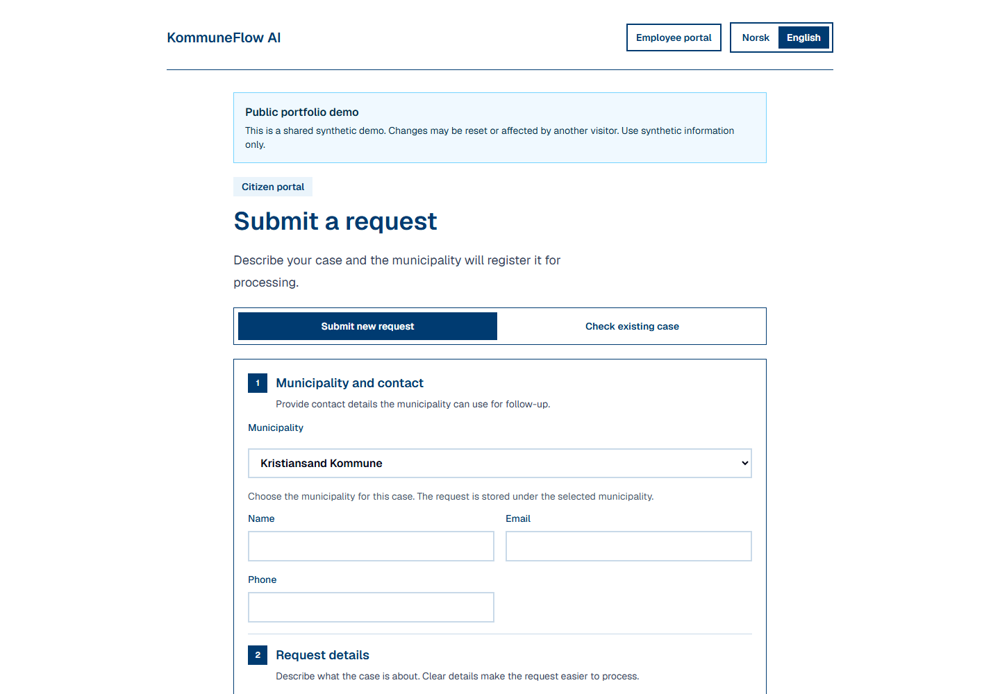
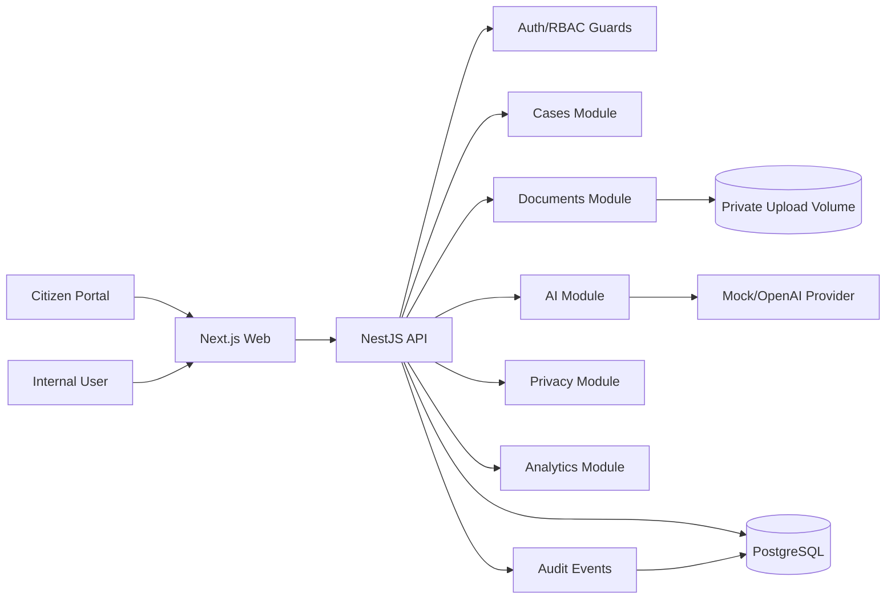
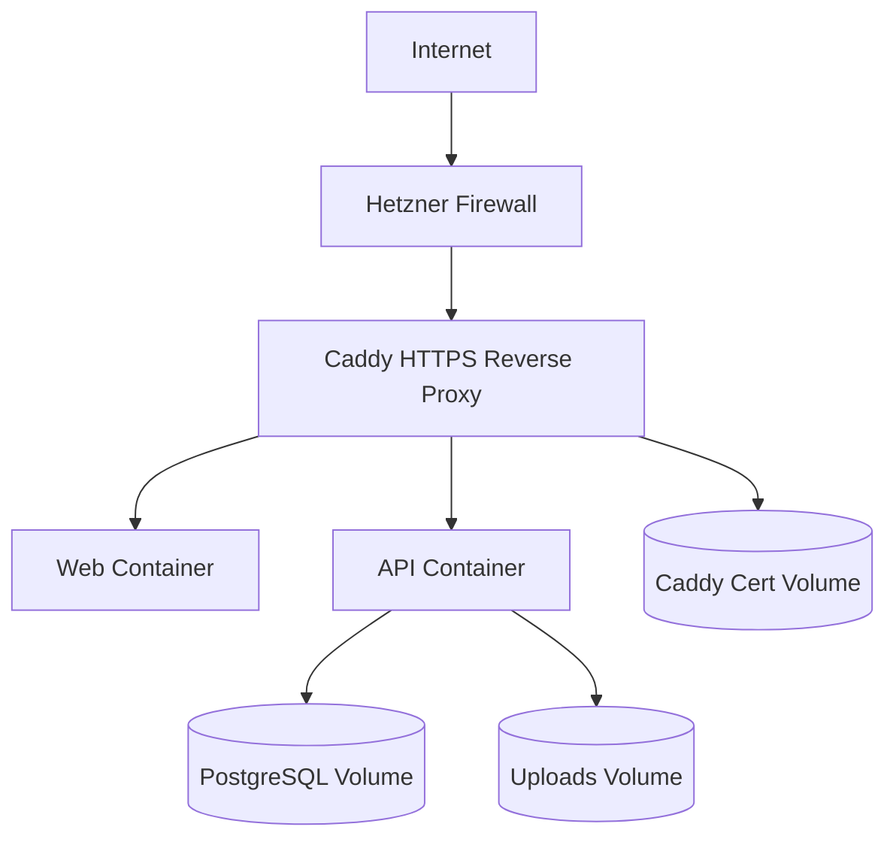

# KommuneFlow AI

KommuneFlow AI is a working portfolio application for municipal case management. A citizen submits a request, AI prepares a structured suggestion, and an employee reviews that suggestion before processing the case. Important actions remain auditable throughout.

**Problem:** municipal requests often arrive through fragmented channels and require manual routing, limited operational visibility, and careful handling of sensitive data. KommuneFlow AI demonstrates one coherent, traceable workflow while keeping AI in a decision-support role: official case values change only after human review.

[](https://kommune.norvix.no)

> No account is required for the public portfolio demo. Citizen intake is public, and the employee workspace starts a restricted, short-lived guest session with one click. Normal staff login remains available for controlled RBAC and administration testing.

The public deployment uses synthetic shared data and deterministic mock AI. Public uploads are disabled, visitor changes may be reset automatically, and the system is not approved for real municipal use.



Case evidence is split between the [guest case queue](./docs/screenshots/07-guest-case-queue.png), [opened case Overview](./docs/screenshots/08-case-overview.png), and [human AI review](./docs/screenshots/09-ai-review.png).

**Stack:** TypeScript | Next.js | NestJS | PostgreSQL | Prisma | Zod | Python ELT | Docker Compose | Caddy | OpenAI

**Key capabilities:** bilingual citizen intake | Kartverket address validation | tenant isolation and RBAC | human-in-the-loop AI triage | case and document workflows | audit, privacy, retention, and operations views | SSB-enriched analytics

**Project status:** functional, access-controlled portfolio demonstration with synthetic data, production-like infrastructure, and automated test coverage. See the current [verification log](./docs/VERIFICATION_LOG.md) for exact executed results. It is **not** a certified or production-approved municipal system and must not be used with real citizen data.

## Product Walkthrough

Citizens submit a synthetic request and receive a case reference and private status access code. They can check status and continue directly into the same municipality's employee demo. The restricted guest can review cases, run and review mock-AI triage, update the workflow, and view existing analytics; administrative, privacy, audit, upload, delete, and analytics-aggregation capabilities remain unavailable.

The demo also includes role and tenant boundaries, privacy actions, retention controls, audit evidence, security hardening, and production-like deployment assets so reviewers can assess more than a happy-path UI. See the [demo script](./docs/DEMO_SCRIPT.md) for a concise walkthrough.

## Architecture


```mermaid
flowchart LR
  Citizen[Citizen Portal] --> Web[Next.js Web]
  Employee[Internal User] --> Web
  Web --> API[NestJS API]
  API --> Auth[Auth/RBAC Guards]
  API --> Cases[Cases Module]
  API --> Docs[Documents Module]
  API --> AI[AI Module]
  API --> Privacy[Privacy Module]
  API --> Analytics[Analytics Module]
  API --> DB[(PostgreSQL)]
  Docs --> Uploads[(Private Upload Volume)]
  AI --> Provider[Mock/OpenAI Provider]
  API --> Audit[Audit Events]
  Audit --> DB
```

Production target:


```mermaid
flowchart TD
  Internet --> Firewall[Hetzner Firewall]
  Firewall --> Caddy[Caddy HTTPS Reverse Proxy]
  Caddy --> WebContainer[Web Container]
  Caddy --> ApiContainer[API Container]
  ApiContainer --> Postgres[(PostgreSQL Volume)]
  ApiContainer --> UploadVolume[(Uploads Volume)]
  Caddy --> CaddyVolume[(Caddy Cert Volume)]
```

## Security And Privacy

Implemented controls include:

- Password hashing with bcrypt
- `HttpOnly` auth cookie
- JWT expiry, issuer/audience validation, payload validation, and production secret enforcement
- Rate limiting
- Helmet security headers with explicit CSP and denied framing
- Strict CORS allowlist
- Origin/Referer validation for cookie-authenticated mutations
- Explicit JSON/form body limits
- Login success/logout, failed login, and rate-limit blocks persisted as operational events
- Server-side permission guards
- Tenant-scoped database queries
- Negative auth/RBAC/tenant tests
- GitHub Actions security scans with CodeQL and Gitleaks
- File size, extension, MIME, magic-byte, and filename validation
- Private upload storage
- Secure document download with audit events
- Safe error response shape with request IDs
- Privacy export, profile identifier anonymization, retention policy, and retention cleanup
- Aggregated analytics without citizen identifiers

Privacy docs:

- [Privacy Notice](./docs/privacy/PRIVACY_NOTICE.md)
- [Data Processing Inventory](./docs/privacy/DATA_PROCESSING_INVENTORY.md)
- [DPIA-Lite](./docs/privacy/DPIA_LITE.md)
- [Production Security Hardening](./docs/security/PRODUCTION_SECURITY_HARDENING.md)

Cloud extension:

- [Azure, AI Foundry, and Fabric Extension](./docs/AZURE_FABRIC_EXTENSION.md)

## AI Governance

AI suggestions are stored separately from official case fields. The system validates AI output with Zod and records human review decisions. AI provider calls are abstracted behind `AIProvider`, so local tests and demos can use `MockAIProvider` without calling the OpenAI API.

Current limitation: AI calls are still synchronous in the request path. Before real production use, AI processing should move to a background worker, with stronger PII redaction, cost monitoring, and retry/backoff policies.

## Demo Users

Set unpublished local-only seed passwords before running `pnpm --filter @kommuneflow/api prisma:seed`:

```bash
SEED_DEMO_PASSWORD='<demo-only internal password>'
SEED_RECRUITER_PASSWORD='<recruiter review password>'
```

`SEED_RECRUITER_PASSWORD` falls back to `SEED_DEMO_PASSWORD` when it is not set. Keep both values in an ignored environment file and never publish deployment passwords.

| Role                          | Email                                 | Notes                                                         |
| ----------------------------- | ------------------------------------- | ------------------------------------------------------------- |
| Super admin                   | `super.admin@kommuneflow.local`       | Tenant-wide admin and privacy actions                         |
| Kristiansand department admin | `department.admin@kristiansand.local` | Main demo account with case, analytics, and operations access |
| Recruiter demo reviewer       | `recruiter.demo@kristiansand.local`   | Protected portfolio review account with synthetic data only   |
| Kristiansand case worker      | `case.worker@kristiansand.local`      | Department-scoped case handling                               |
| Kristiansand auditor          | `auditor@kristiansand.local`          | Read-only audit/privacy visibility                            |
| Grimstad case worker          | `case.worker@grimstad.local`          | Cross-tenant isolation demo                                   |

Demo credentials are local demo credentials only. They are not displayed in the public login form and must not be enabled in an open public deployment. Use the short-lived, least-privilege guest session for public portfolio access, reserve seeded credentials for controlled reviewer access, and use synthetic data only.

## Demo Data

The seed creates a realistic local portfolio dataset:

- tenants: Kristiansand Kommune, Arendal Kommune, Grimstad Kommune
- five departments per tenant
- 22 realistic cases across statuses, categories, and urgencies
- Norwegian and English case descriptions
- validated address rows with municipality codes
- demo documents
- accepted, corrected, failed, and low-confidence AI triage examples
- SSB municipality population records
- analytics snapshots
- audit and operational events

The seed is idempotent and split into small modules under `apps/api/prisma/seed`.

## Local Setup

Requirements:

- Node.js 24+
- pnpm 10+
- Docker Desktop

Install dependencies:

```bash
pnpm install
```

Copy environment variables:

```bash
cp .env.example .env
```

Start PostgreSQL:

```bash
docker compose up -d postgres
```

Generate Prisma client:

```bash
pnpm --filter @kommuneflow/api prisma:generate
```

Run migrations and seed demo data:

```bash
pnpm --filter @kommuneflow/api prisma:migrate
pnpm --filter @kommuneflow/api prisma:seed
```

Start API and web:

```bash
pnpm run dev
```

`pnpm run dev` starts Postgres, checks whether API/Web are already running, and then runs the missing dev server logs in
your current terminal. Use `pnpm dev:status` to see what is running and `pnpm dev:stop` to stop local API/Web Node
processes.

Local URLs:

- Web: `http://localhost:3000`
- API: `http://localhost:3101/api/v1`
- Citizen intake Norwegian: `http://localhost:3000/nb`
- Citizen intake English: `http://localhost:3000/en`
- Internal login: `http://localhost:3000/internal/login`
- Internal cases: `http://localhost:3000/internal/cases`
- Internal analytics: `http://localhost:3000/internal/analytics`
- Internal operations: `http://localhost:3000/internal/operations`
- Internal privacy: `http://localhost:3000/internal/privacy`

## Verification

Run the full local verification suite:

```bash
pnpm test:all
```

This runs linting, type checks, API coverage tests, API e2e tests, web component tests, Playwright browser smoke tests, and Python ELT tests.

## Useful Commands

```bash
pnpm lint
pnpm typecheck
pnpm test
pnpm test:all
pnpm build
pnpm audit:deps
pnpm --filter @kommuneflow/api test:cov:ci
pnpm --filter @kommuneflow/api test:e2e
pnpm --filter @kommuneflow/web test
pnpm --filter @kommuneflow/web test:e2e
pnpm --filter @kommuneflow/api prisma:migrate
pnpm --filter @kommuneflow/api prisma:seed
cd apps/etl && python -m pytest -q
```

Manual SSB verification command:

```bash
cd apps/etl
python -m kommuneflow_elt.cli import-ssb --year 2025 --municipality-code 4203
```

Do not run real Kartverket, SSB, or OpenAI calls in CI.

Recommended required checks are documented in [Branch Protection](./docs/BRANCH_PROTECTION.md). The optional manual `OpenAI Smoke` workflow is intentionally not required for merges.

## API Overview

See [API Reference](./docs/API_REFERENCE.md).

Main API groups:

- `auth`
- `public/tenants/:tenantSlug/cases`
- `cases`
- `documents`
- `ai-triage`
- `analytics`
- `integrations/kartverket`
- `integrations/ssb`
- `operations`
- `privacy`
- `health` and `readiness`

## Production Deployment

The repository includes production-like deployment assets:

- `apps/api/Dockerfile`
- `apps/web/Dockerfile`
- `docker-compose.prod.yml`
- `deploy/Caddyfile`
- `.env.production.example`
- `scripts/backup-postgres.sh`
- `scripts/backup-uploads.sh`
- `scripts/restore-postgres.sh`
- `scripts/smoke-test.sh`

### Home-server portfolio deployment

The home-server demo runs behind the server's global Caddy reverse proxy. Only the project gateway joins the shared `proxy` network; PostgreSQL, API, and web stay on a private project network, and no application service publishes host ports. The web perimeter is public, application JWT/RBAC protects internal data, the optional guest session is feature-flagged and least-privilege, AI uses the mock provider, and only synthetic data is permitted.

This deployment is not approved for real municipal use. Automated backup and restore operations remain future work. See [Home-Server Deployment](./docs/HOME_SERVER_DEPLOYMENT.md) for topology, secrets, release, seed, DNS, and verification steps.

Basic production flow:

```bash
cp .env.production.example .env.production
docker compose -f docker-compose.prod.yml --env-file .env.production build
docker compose -f docker-compose.prod.yml --env-file .env.production up -d postgres
docker compose -f docker-compose.prod.yml --env-file .env.production run --rm --entrypoint sh api -lc "./node_modules/.bin/prisma migrate deploy"
docker compose -f docker-compose.prod.yml --env-file .env.production up -d
sh scripts/smoke-test.sh https://your-domain.example
```

Authenticated smoke checks are optional. Add internal demo credentials only when the deployed environment has been
seeded with synthetic demo users:

```bash
SMOKE_INTERNAL_EMAIL=department.admin@kristiansand.local \
SMOKE_INTERNAL_PASSWORD='<demo internal password>' \
sh scripts/smoke-test.sh https://your-domain.example
```

See [Hetzner Deployment](./docs/07_DEPLOYMENT_HETZNER.md) for firewall, HTTPS, backup, restore, and smoke-test details.
See [Production Security Hardening](./docs/security/PRODUCTION_SECURITY_HARDENING.md) for the distinction between implemented demo controls, known production gaps, and target controls for real municipal use.

AI deployment mode is controlled server-side:

- use `AI_PROVIDER=mock` for no-cost portfolio demos
- use `AI_PROVIDER=openai` with `OPENAI_API_KEY`, `OPENAI_MODEL`, and `OPENAI_TIMEOUT_MS` for real OpenAI triage
- never commit `OPENAI_API_KEY` or include it in logs, screenshots, backups, or documentation

After deploy, log in internally, open Operations, verify the AI Configuration panel, then run AI triage on a seeded or synthetic case.

Deployment evidence is recorded by exact commit in the [verification log](./docs/VERIFICATION_LOG.md). The latest PR 6 documentation and screenshots are locally verified until that reviewed commit is merged and deployed; older home-server results must not be treated as verification of the current branch. The public portfolio configuration requires deterministic `AI_PROVIDER=mock`.

## Testing Status

Current verified commands:

```txt
pnpm test:all PASS
pnpm build    PASS
```

The exact PR 6 commands and counts are recorded in the [verification log](./docs/VERIFICATION_LOG.md). Coverage includes auth, RBAC, tenant isolation, upload abuse and portfolio upload denial, AI safety, analytics permission separation, privacy, operations, reset safety, the unauthenticated perimeter, and the credential-free citizen-to-guest browser journey.

## How to Demo

Use synthetic data only. The public path needs no account: start at `/`, submit through `/en` or `/nb`, then use **Continue in employee demo**. Reserve normal staff credentials for controlled RBAC and administration testing; never publish them.

### Demo User Table

| Demo path             | Email                                 | Role               | What to show                                                       |
| --------------------- | ------------------------------------- | ------------------ | ------------------------------------------------------------------ |
| Main internal demo    | `department.admin@kristiansand.local` | `department_admin` | Cases, AI triage, analytics, operations, admin read-only views     |
| Recruiter review demo | `recruiter.demo@kristiansand.local`   | `department_admin` | Protected portfolio review account with Kristiansand demo data     |
| Case worker scope     | `case.worker@kristiansand.local`      | `case_worker`      | Department-scoped case queue and hidden analytics/operations/admin |
| Auditor/read-only     | `auditor@kristiansand.local`          | `auditor`          | Tenant-wide read-only case access, audit visibility, no mutation   |
| Tenant isolation demo | `case.worker@grimstad.local`          | `case_worker`      | Cross-tenant isolation compared with Kristiansand data             |
| Full admin demo       | `super.admin@kommuneflow.local`       | `super_admin`      | Tenant-level admin, privacy export/anonymization, diagnostics      |

Set `SEED_DEMO_PASSWORD` and, when needed, `SEED_RECRUITER_PASSWORD` in the ignored local environment before running the seed. Do not publish passwords in screenshots, documentation, logs, or the login UI.

### Public Citizen Flow

1. Open `http://localhost:3000/nb` or `http://localhost:3000/en`.
2. Use **Submit new request**.
3. Select a municipality, enter synthetic contact details, search/confirm an address, and add request details. Public portfolio uploads are disabled.
4. Submit the case.
5. Save the displayed case reference and access code.
6. Switch to **Check existing case** and verify the status lookup with the saved values.

### Public Guest Employee Flow

1. Select **Continue in employee demo** after submission, or **Explore employee demo** on the landing page.
2. The server creates an allowlisted, short-lived `portfolio_guest` cookie without exposing a password or token.
3. Confirm the banner shows the portfolio guest role and municipality.
4. Open **Dashboard** and review case counts by workflow status.
5. Open **Cases**; continuation from citizen intake pre-fills the submitted case reference.
6. Open a case detail page.
7. Show address enrichment, official values, seeded document examples, workflow timeline, internal notes, and recent activity.
8. Run/review mock AI and update status. Upload, delete, audit, privacy, operations, administration, and analytics aggregation remain denied.

### AI Triage Flow

1. Open a case with status `triage_pending` or a newly submitted case assigned to the department.
2. Run AI triage.
3. Show that AI suggested category, department, urgency, confidence, missing information, and reasoning are separate from official case values.
4. Accept or correct the suggestion as a human reviewer.
5. Confirm official case values update only after review.
6. Use seeded Kristiansand cases for edge cases:
   - `seed_kristiansand_case_blocked_access` for low-confidence AI.
   - `seed_kristiansand_case_unclear_attachment` for failed AI.

### Role-Based Access Demo

1. Log in as `case.worker@kristiansand.local` and show a narrow navigation surface focused on Dashboard and Cases.
2. Log in as `auditor@kristiansand.local` and show read-only case access with mutation controls hidden/blocked.
3. Log in as `department.admin@kristiansand.local` and show analytics, operations, users, departments, and routing rules.
4. Log in as `case.worker@grimstad.local` and show that Kristiansand cases are not visible.
5. Log in as `super.admin@kommuneflow.local` only when you need to demonstrate tenant-level admin or privacy actions.

### Analytics, Operations, Privacy, And Audit

1. Open **Analytics** as the guest and show existing case volume and AI review/correction metrics.
2. Point out that aggregation is absent and server-side `analytics:aggregate` authorization denies it.
3. Open **Operations** and show health/readiness, integration metrics, upload failures, rate-limit blocks, operational events, and AI provider status.
4. Open **Privacy** as a super admin to demonstrate export, anonymization, retention policy, and cleanup dry-run.
5. Open **Audit** as auditor or super admin to show tenant-scoped audit events and safe metadata summaries.

### OpenAI Mode Vs Mock Mode

- Local and no-cost demos should use `AI_PROVIDER=mock`.
- The normal portfolio deployment uses `AI_PROVIDER=mock`.
- Real OpenAI triage is verified separately through the manual protected workflow and requires the `OPENAI_API_KEY` repository secret.
- Verify the active provider in **Operations** before demoing AI.
- Never commit, print, screenshot, or document `OPENAI_API_KEY`.

### Deployment Verification

After a deployed update:

```bash
sh scripts/smoke-test.sh https://your-domain.example
```

For seeded demos, also verify authenticated internal APIs:

```bash
SMOKE_INTERNAL_EMAIL=recruiter.demo@kristiansand.local \
SMOKE_INTERNAL_PASSWORD='<demo internal password>' \
sh scripts/smoke-test.sh https://your-domain.example
```

The smoke test checks web root, public intake, API health/readiness, internal login, and optionally `/auth/me`, `/cases`,
and `/ai/status`.

See [Demo Script](./docs/DEMO_SCRIPT.md) for a shorter live walkthrough.

## Known Limitations

- The public portfolio deployment is shared rather than isolated per visitor; data can change and is periodically reset.
- Citizen status lookup is implemented with case reference and access code, but a richer citizen portal is still future work.
- Email confirmation is logged through a mock provider; real SMTP/transactional email is future production work.
- Document OCR/PDF text extraction is not implemented.
- Malware scanning is represented as a future provider concern, not a real scanner.
- Citizen profile anonymization does not fully anonymize free text, uploaded documents, filenames, AI summaries, audit records, email logs, or archive-bound records.
- Backup scripts support optional GPG encryption, but offsite transfer, storage access control, and scheduled restore tests are production operations outside this demo.
- AI calls are synchronous in the request path.
- AI prompt redaction/minimization should be expanded before real production use.
- Privacy actions have a simple internal UI; a fuller workflow with approvals and scheduled retention jobs is future work.

## Future Improvements

- Deploy and re-verify the exact reviewed PR 6 commit before calling its evidence live
- Scheduled restore testing, offsite backup operations, and monitoring hardening
- Background worker for AI triage, analytics rebuild, SSB import, and notification delivery
- Real email provider integration
- PDF text extraction and document summarization
- Malware scanning provider
- Route-level internal locale URLs if the demo needs shareable localized internal links
- API OpenAPI/Swagger generation
- Object storage adapter
- Advanced audit search UI
- Deployment monitoring and metrics dashboard

## Portfolio Description

KommuneFlow AI is a portfolio project inspired by Norwegian municipal digital services. It is a multi-tenant platform for citizen case intake, Kartverket address validation, document workflows, human-reviewed AI triage, role-based access control, audit logging, privacy operations, retention, SSB-enriched analytics, and operations monitoring. AI is used as decision support, not as an automatic decision-maker.

## Workspace Structure

```txt
apps/
  api/
  etl/
  web/
docs/
```

## Development Rules

- Code, API routes, database names, comments, and documentation are written in English.
- User-facing UI supports Norwegian Bokmal (`nb`) and English (`en`) where implemented.
- Authorization and tenant isolation are enforced server-side.
- AI output is treated as untrusted data and validated before storage.
