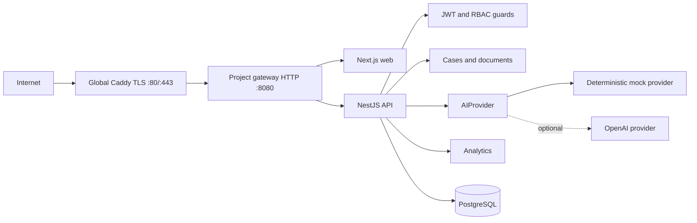

# KommuneFlow AI

KommuneFlow AI is a working portfolio implementation of municipal case
management. A citizen submits a request, a provider prepares a structured
suggestion, and an employee reviews that suggestion before official case
values change.

**Problem:** municipal requests often arrive through fragmented channels and
need careful routing, traceability, and handling of sensitive information.
This repository demonstrates one coherent citizen-to-employee workflow. It is
not an approved SaaS product or a system for real citizen data.

[Live demo](https://kommune.norvix.no)

The public demo uses shared synthetic data, deterministic mock AI, and a
short-lived restricted guest session. Public uploads are disabled. Changes may
be reset or affected by another visitor. No account is required for the public
portfolio path; normal staff login remains a separate controlled path.

## Start Here

- [Demo script](./docs/DEMO_SCRIPT.md)
- [API reference](./docs/API_REFERENCE.md)
- [Security and privacy](./docs/03_SECURITY_AND_PRIVACY.md)
- [AI governance](./docs/04_AI_GOVERNANCE.md)
- [Home-server deployment](./docs/HOME_SERVER_DEPLOYMENT.md)
- [Screenshots](./docs/SCREENSHOTS.md)
- [Verification log](./docs/VERIFICATION_LOG.md)

## Product Journey

1. A citizen chooses a municipality and submits synthetic text through the
   Norwegian or English intake.
2. The API returns a case reference and a private status access code. The code
   is used in the JSON body of the status lookup and is not placed in a URL.
3. The citizen can continue to the same municipality's employee demo.
4. The server creates an allowlisted, short-lived `portfolio_guest` session.
5. The guest reviews cases, opens a case, runs deterministic mock AI, and
   accepts or corrects the suggestion.
6. The employee workflow changes only after explicit human review. The current
   deployed guest Analytics page is a synthetic reference view; the compact
   post-PR #29 layout is not live because PR #29 remains open.

The guest role cannot access administration, privacy, audit, operations,
document upload/delete, or analytics aggregation. These boundaries are enforced
by server-side permissions and are documented in the security and verification
documents.

## Architecture


```mermaid
flowchart LR
  Internet --> GlobalCaddy[Global Caddy TLS :80/:443]
  GlobalCaddy --> Gateway[Project gateway HTTP :8080]
  Gateway --> Web[Next.js web]
  Gateway --> API[NestJS API]
  API --> Auth[JWT and RBAC guards]
  API --> Cases[Cases and documents]
  API --> AI[AIProvider]
  API --> Analytics[Analytics]
  API --> DB[(PostgreSQL)]
  AI --> Mock[Deterministic mock provider]
  AI -. optional .-> OpenAI[OpenAI provider]
```

The current public deployment is the home-server topology: global Caddy
terminates TLS, while the project gateway runs on the private proxy network
and applies routing, security headers, and request-size limits. PostgreSQL,
API, and web remain on the private project network. See the
[deployment runbook](./docs/HOME_SERVER_DEPLOYMENT.md) and
[verification evidence](./docs/VERIFICATION_LOG.md).

Hetzner files are retained as [alternative deployment assets](./docs/alternatives/07_DEPLOYMENT_HETZNER.md),
not as evidence of the current live deployment. Azure/Fabric material is
[architecture exploration](./docs/explorations/AZURE_FABRIC_EXTENSION.md) and
is not implemented.

## Security And Privacy Summary

The implementation includes password hashing, HttpOnly authentication cookies,
JWT validation, rate limiting, security headers, CORS and origin validation,
request-size limits, server-side permission guards, tenant-scoped queries,
upload validation, private upload storage, safe error responses, audit events,
privacy export/anonymization controls, retention cleanup, and negative auth,
RBAC, tenant, upload, and guest-perimeter tests.

These are implemented portfolio controls, not a certification or a claim of
regulatory compliance. Privacy documentation describes the intended controls
and remaining limitations.

- [Security and privacy](./docs/03_SECURITY_AND_PRIVACY.md)
- [Production security hardening](./docs/security/PRODUCTION_SECURITY_HARDENING.md)
- [Privacy notice](./docs/privacy/PRIVACY_NOTICE.md)
- [Data processing inventory](./docs/privacy/DATA_PROCESSING_INVENTORY.md)
- [DPIA-lite](./docs/privacy/DPIA_LITE.md)

## AI Governance

AI suggestions are separate from official case fields, validated with Zod, and
record human review decisions. The provider is selected behind the
`AIProvider` abstraction. Local tests and the public deployment use the
deterministic mock provider. OpenAI is an optional provider for a protected
manual workflow; this repository does not claim that real OpenAI has been
verified unless a dated successful run is recorded in the verification log.

Current AI execution is synchronous in the request path. Background workers,
stronger PII redaction, cost monitoring, retries, and production operational
controls remain future work.

See [AI governance](./docs/04_AI_GOVERNANCE.md) and
[the provider ADR](./docs/adr/0004-ai-provider-abstraction.md).

## Implemented Scope And Limitations

- Bilingual citizen and internal portfolio workflows support Norwegian and
  English.
- The public path uses synthetic data and disables public uploads.
- Guest Analytics is a synthetic reference view, not a live SSB or municipal
  performance report. The deployed commit still contains the earlier view;
  post-PR #29 compact layout changes are pending merge and deployment.
- SSB integration code exists, but this README does not claim a completed live
  import without dated evidence.
- Background jobs, scheduled backup/restore testing, real OpenAI verification,
  and a full tenant/user/feature-management product surface are not claimed as
  implemented portfolio behavior.
- The application is not approved for production municipal use.

## Stack

The selected implementation uses TypeScript, Next.js, NestJS, PostgreSQL,
Prisma, Zod, Python ELT tests, Docker Compose, Caddy, and Vitest/Jest/
Playwright. OpenAI is optional behind `AIProvider`; the public mode is mock AI.

## Local Setup

Requirements: Node.js 24+, pnpm 10+, and Docker Desktop.

```bash
pnpm install
cp .env.example .env
docker compose up -d postgres
pnpm --filter @kommuneflow/api prisma:generate
pnpm --filter @kommuneflow/api prisma:migrate
pnpm --filter @kommuneflow/api prisma:seed
pnpm run dev
```

Local URLs:

- Web: `http://localhost:3000`
- API: `http://localhost:3101/api/v1`
- Citizen intake: `http://localhost:3000/nb` or `/en`
- Internal login: `http://localhost:3000/internal/login`
- Internal cases: `http://localhost:3000/internal/cases`
- Internal analytics: `http://localhost:3000/internal/analytics`

Use ignored local environment values for seeded passwords. Do not publish
passwords, access codes, cookies, or private operational values.

## Verification

```bash
pnpm lint
pnpm typecheck
pnpm test:all
pnpm build
pnpm audit:deps
git diff --check
```

The exact local, CI, and live results are recorded in the
[verification log](./docs/VERIFICATION_LOG.md). A dependency audit finding is
reported as a finding; it is not relabeled as clean.

## API Overview

The API groups are `auth`, public tenant cases, `cases`, `documents`,
`ai-triage`, `analytics`, Kartverket and SSB integrations, `operations`,
`privacy`, `health`, and `readiness`. See the
[API reference](./docs/API_REFERENCE.md) for the current method, path, body,
permission, and response conventions.

## Deployment

The current public deployment is the home server at
`https://kommune.norvix.no`. The deployment runbook documents the project
Compose file, global Caddy boundary, private proxy network, health checks,
release procedure, backups, rollback notes, and evidence links. It uses mock AI
and synthetic data.

```bash
docker compose -f compose.home.yml --env-file .env.home up -d --build
```

Run the repository's documented release procedure rather than treating this
command as a complete operational release. See
[Home-server deployment](./docs/HOME_SERVER_DEPLOYMENT.md).

Alternative deployment material is explicitly separated from the current
deployment:

- [Hetzner alternative](./docs/alternatives/07_DEPLOYMENT_HETZNER.md)
- [Azure/Fabric exploration](./docs/explorations/AZURE_FABRIC_EXTENSION.md)

## Repository Map

- `apps/api`: NestJS API, Prisma schema, migrations, seed, and tests.
- `apps/web`: Next.js citizen and internal portfolio workflows.
- `apps/shared`: shared public documentation-safe types and capability data.
- `apps/etl`: Python integration helpers and tests.
- `docs`: current product, security, deployment, demo, and evidence documents.
- `deploy`: container gateway and reverse-proxy configuration.
- `.github/workflows`: CI and protected manual verification workflows.

## Further Reading

- [Product requirements](./docs/01_PRODUCT_REQUIREMENTS.md)
- [Tech stack and architecture](./docs/05_TECH_STACK_AND_ARCHITECTURE.md)
- [Testing strategy](./docs/06_TESTING_STRATEGY.md)
- [Domain model](./docs/02_DOMAIN_MODEL.md)
- [Runbook](./docs/RUNBOOK.md)
- [Branch protection](./docs/BRANCH_PROTECTION.md)
