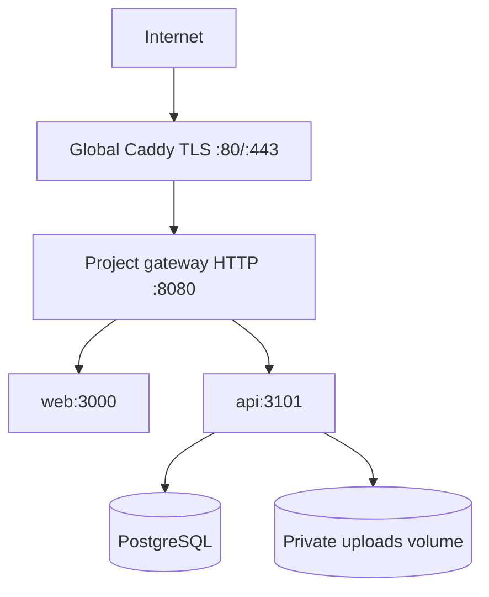

# Home-Server Deployment

This is the runbook for the current portfolio deployment at
`https://kommune.norvix.no`. Replace all bracketed values with local operator
values. Do not commit secrets, private IPs, passwords, access codes, or real
reviewer identities.

## Topology



Global Caddy terminates TLS on ports 80/443. The project-local gateway joins
the private proxy network, listens on HTTP port 8080, routes traffic, applies
security headers, and limits API request bodies. API, web, and PostgreSQL are
on the private project network and do not publish host ports.

Authoritative files: [compose.home.yml](../compose.home.yml),
[deploy/home/Caddyfile](../deploy/home/Caddyfile), this runbook, and the
[verification log](./VERIFICATION_LOG.md).

## Prerequisites

- home server working directory: `[HOME_SERVER_PROJECT_DIR]`
- operator SSH target: `[HOME_SERVER_SSH_TARGET]`
- Docker and Compose plugin
- external Docker network named `proxy`
- populated ignored home environment file
- public DNS for `kommune.norvix.no` pointing to the global proxy

The runbook intentionally uses placeholders instead of a private LAN address
or concrete reviewer email examples.

## Release Procedure

Run from the repository root on the home server:

```bash
git fetch origin main
git pull --ff-only origin main
./scripts/home-release.sh
```

The script performs preflight checks, backup checks, image builds, migrations,
health checks, smoke tests, and the deployment evidence summary. Inspect the
output and record the exact deployed commit in
[VERIFICATION_LOG.md](./VERIFICATION_LOG.md).

## Policy Checks

- `AI_PROVIDER=mock` for the public portfolio.
- `PUBLIC_DEMO_ALLOW_UPLOADS=false`.
- synthetic seed data only.
- API, web, and PostgreSQL have no host-published ports.
- the gateway is the only project service on the shared proxy network.

## Backups And Restore

The repository includes manual scripts for PostgreSQL and upload backups and a
manual restore script. These scripts are operational tools, not evidence of a
scheduled backup service or a completed restore test. A future operational
change must record schedule ownership, retention, restore testing, and results
separately.

## Smoke And Rollback

Use the documented smoke command with the public domain and synthetic data. Do
not include access codes in command history or logs. For rollback, use the
previous image/repository commit only after checking the backup and migration
prerequisites. Record what was actually executed in the verification log.

Hetzner deployment material is retained separately as an alternative and is
not the current live deployment.
